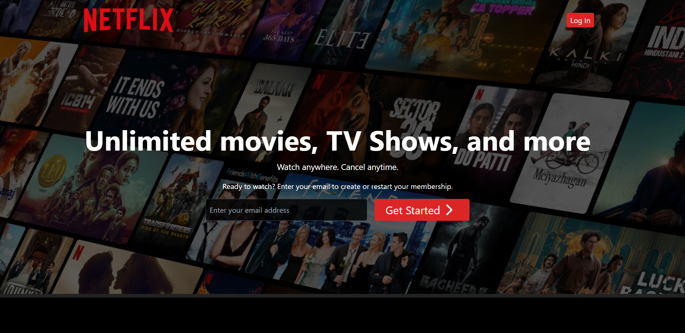
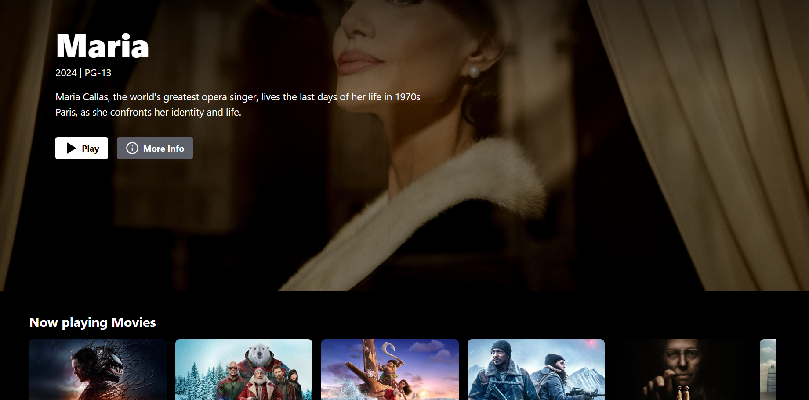
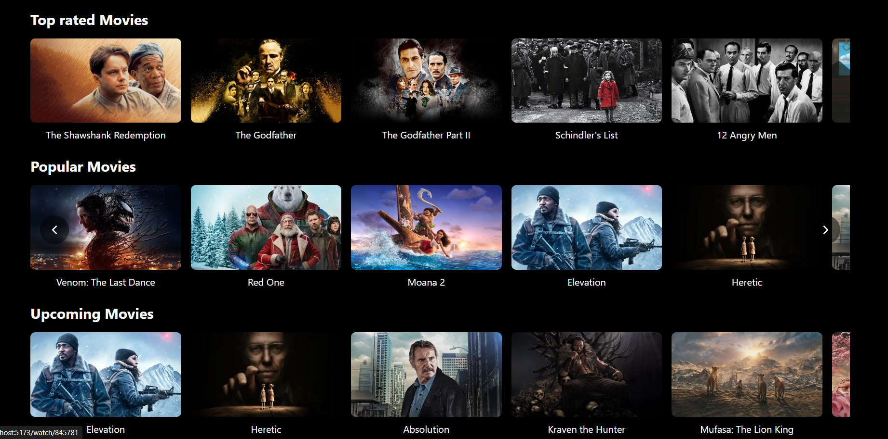

# Netflix Clone

A full-stack MERN (MongoDB, Express, React, Node.js) Netflix Clone project.

## Table of Contents
- [Overview](#overview)
- [Features](#features)
- [Technologies Used](#technologies-used)
- [Installation](#installation)
- [Running the Project](#running-the-project)
- [Folder Structure](#folder-structure)
- [Learning Outcomes](#learning-outcomes)
- [Author](#author)
- [Layout](#layout)

## Overview
This project is a Netflix Clone built using the MERN stack. It includes a frontend built with React and Tailwind CSS, and a backend using Express and MongoDB. The app supports user authentication, video streaming, and state management.

## Features
- User Authentication (Signup/Login)
- Secure JWT-based Authentication
- Browse Movies and TV Shows
- Video Playback using React Player
- Responsive Design
- State Management with Zustand
- Real-time Notifications using React Hot Toast

## Technologies Used

### Frontend Libraries Explained:
- **React**: JavaScript library for building interactive user interfaces.
- **Tailwind CSS**: Utility-first CSS framework for styling.
- **React Router DOM**: Enables client-side routing.
- **Axios**: For making HTTP requests to the backend.
- **Zustand**: State management library for handling global state.
- **React Hot Toast**: Library for displaying notifications.
- **Vite**: Development server and build tool for fast frontend development.

### Backend Libraries Explained:
- **Node.js**: JavaScript runtime for server-side development.
- **Express.js**: Web framework for building REST APIs.
- **MongoDB (Mongoose)**: NoSQL database for data storage and management.
- **MongoDB Atlas**: Cloud-based database service for scalable and secure storage.
- **MongoDB Compass**: GUI tool for managing and visualizing MongoDB databases.
- **JWT Authentication**: For securing API endpoints using JSON Web Tokens.
- **Bcrypt.js**: For hashing passwords to ensure secure authentication.
- **Cookie Parser**: For parsing cookies in HTTP requests.
- **Dotenv**: For managing environment variables.
- **Postman**: API testing tool for validating backend endpoints.

## Installation

### Prerequisites:
- Node.js installed
- MongoDB running locally or on a cloud service

### Clone the Repository:
```bash
git clone https://github.com/riyal-rj/netFlix-Clone.git
cd netflix-clone
```

### Setup the Backend:
```bash
cd backend
npm install
```

### Create a .env file in the backend directory and add:
```
MONGO_URI=your_mongo_db_connection_string
JWT_SECRET=your_jwt_secret
PORT=5000
```

### Start the Backend:
```bash
npm run dev
```

### Setup the Frontend:
```bash
cd ../frontend
npm install
```

### Start the Frontend:
```bash
npm run dev
```

## Running the Project
1. Start the backend server.
2. Start the frontend development server.
3. Visit `http://localhost:5173` (or the port shown in your terminal) to use the application.

## Folder Structure
```
/netflix-clone
  ├── backend
  │   ├── models
  │   ├── routes
  │   ├── controllers
  │   └── server.js
  └── frontend
      ├── src
      │   ├── components
      │   ├── pages
      │   ├── context
      │   └── App.js
```

## Learning Outcomes
- Gained experience with the MERN stack for full-stack development.
- Implemented secure authentication using JWT and bcrypt.
- Enhanced state management knowledge with Zustand.
- Learned React best practices, including component-based design and routing.
- Built a responsive UI using Tailwind CSS.
- Developed API integration using Axios.
- Understood the process of deploying a full-stack application.

## Author
**riyalRJ**

Feel free to contribute or raise issues for improvements!

## Layout
**HomePage -without Auth**

**HomePage -with Auth**



